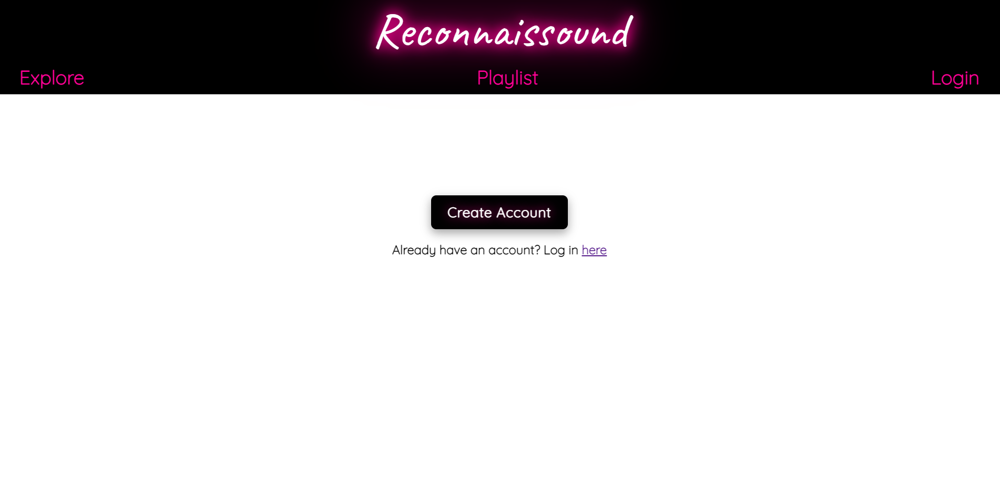
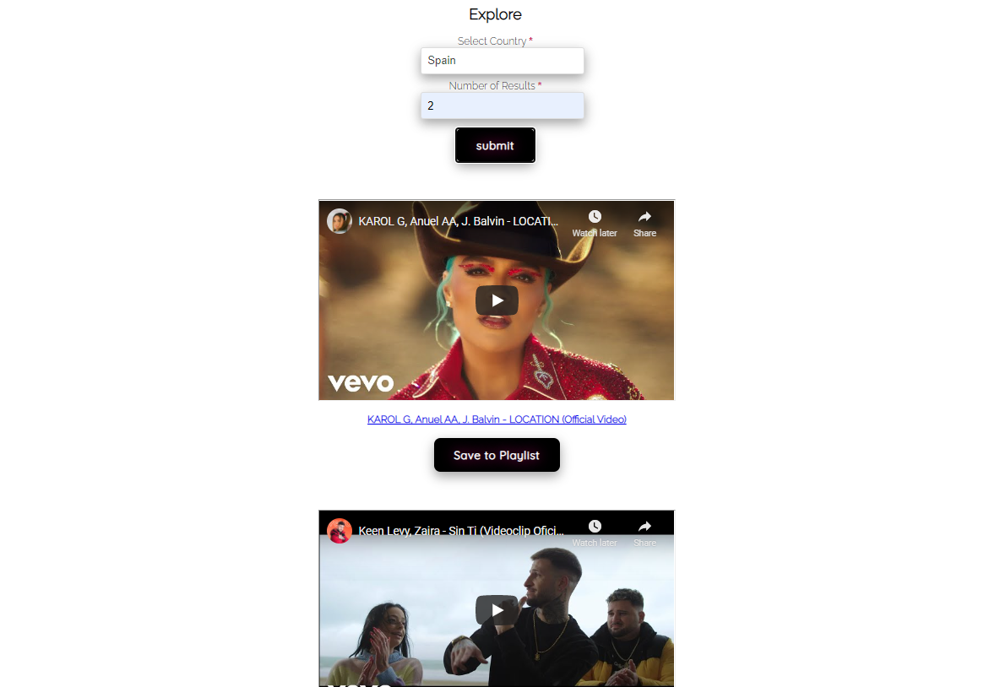
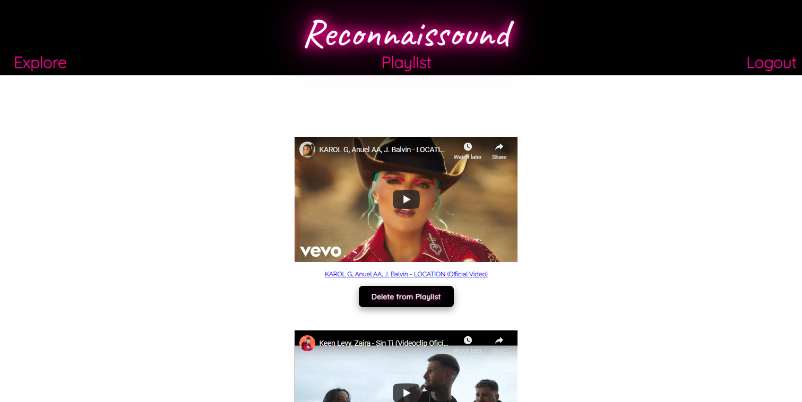

Reconnaissound

The Reconnaissound web app lets users generate a list of trending YouTube music videos from any country in the world. Users can watch the videos directly on the web app, without needing to follow links to Youtube. Users can also save any of the content to their personalized playlist.

To set up a playlist, a user must create an account first. Their credentials are encrypted and JSON Web Tokens (JWTs) are used to grant authorization.

Here's a link to the live app: https://reconnaissound-client.vercel.app/

You can access repo to the client app here: https://github.com/KyleEriss/reconnaissound-client

You can access repo to the server app here: https://github.com/KyleEriss/reconnaissound-server

Landing page:

Explore music page:

Playlist page:

Tech used includes React, Node, Express, PostgreSQL, JWTs for authorization, and CSS animations
